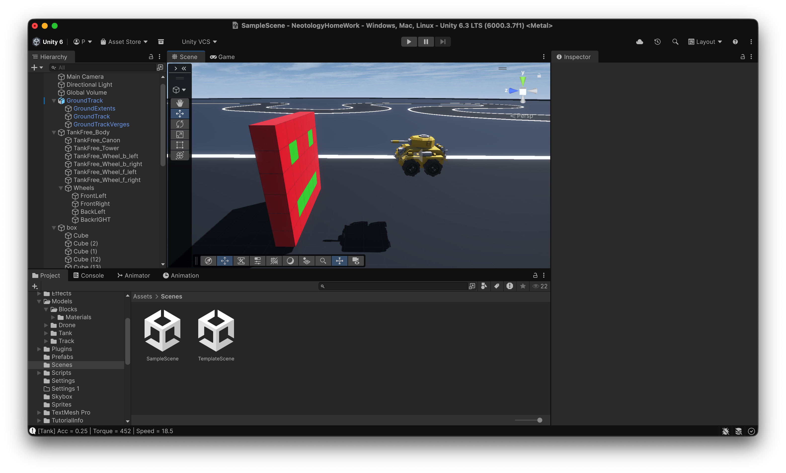
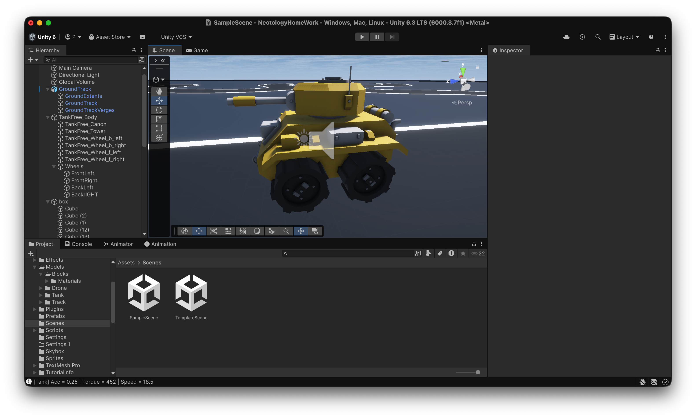
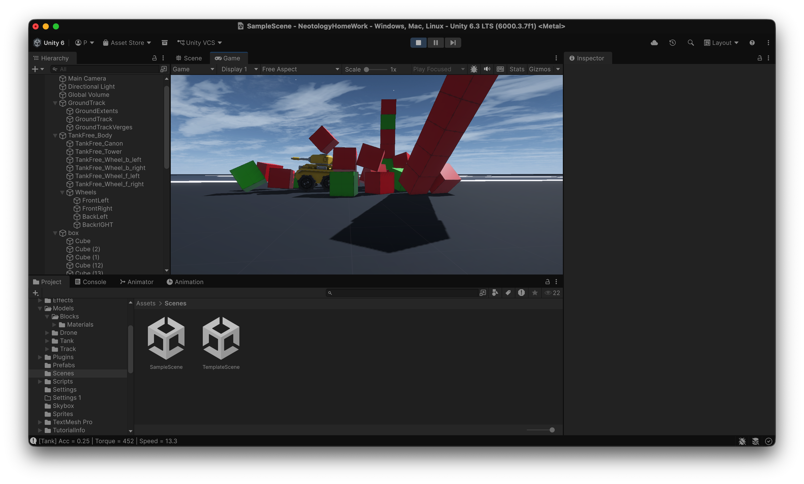

# Домашнее задание: Танки (Unity)


## Описание проекта

Выполнено домашнее задание по теме **«Основы Unity-физики»**.

В проекте собрана сцена с полностью настроенным танком, который **автоматически движется вперёд** и взаимодействует с препятствиями в виде кубиков.

---

## Скриншоты

### Общий вид сцены



*Главный вид сцены с танком и окружением.*

### Танк крупным планом



*Настроенный танк с Wheel Collider.*

### Танк в движении



*Танк движется по сцене и сталкивается с препятствиями.*

---

## Как запустить проект

1. Склонируйте репозиторий:

```bash
git clone https://github.com/emo-ang3l/RuhlinA_GUNEU46.git
```

2. Откройте проект через **Unity Hub**:

   * Нажмите **Add Project from Disk**.
   * Выберите папку проекта.

3. Откройте сцену:

```text
Assets/Scenes/SampleScene.unity
```

4. Нажмите кнопку **Play ▶️**.

После запуска танк автоматически начнёт движение вперёд и столкнётся с установленными на сцене препятствиями.

---

## Что было реализовано

* Импорт и настройка модели танка.
* Подключение **Test Input Controller** для автоматического движения.
* Настройка физики колёс с использованием **Wheel Collider** и подвески.
* Реализация прижимания танка к поверхности.
* Создание игровой сцены:

  * плоскость (земля);
  * освещение;
  * препятствия в виде кубиков.
* Настройка корректного файла `.gitignore`.
* Организация чистой структуры проекта.

---

## Используемые технологии

* Unity 6
* Cinemachine
* New Input System
* Unity Physics (Rigidbody + Wheel Collider)

---

